## REST API using Spring Boot

### 시나리오
사용자와 관련된 REST API 제작, (사용자가 작성하는 간단한 글)  
- 한명의 사용자는 여러개의 포스팅 가능  
	-> User와 Posts는 1대다의 관계를 가진다.  

제공하는 기능: `조회, 생성, 삭제 기능`  

Description|REST API|HTTP Method
------------|----------|----------
전체 사용자 조회|/users|GET
사용자 생성|/users|POST
특정 사용자 조회|/users/{id}|GET
특정 사용자 삭제|/users/{id}|DELETE
사용자의 모든 포스트 조회|/users/{id}/posts|GET
사용자의 포스트 생성|/users/{id}/posts|POST
사용자의 상세 정보 조회|/users/{id}/posts/{post_id}|GET

## 과정
1. HelloWorldController를 등록하여 web과 POSTMAN을 통해 확인해봄.  
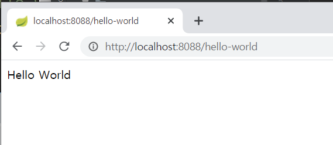  
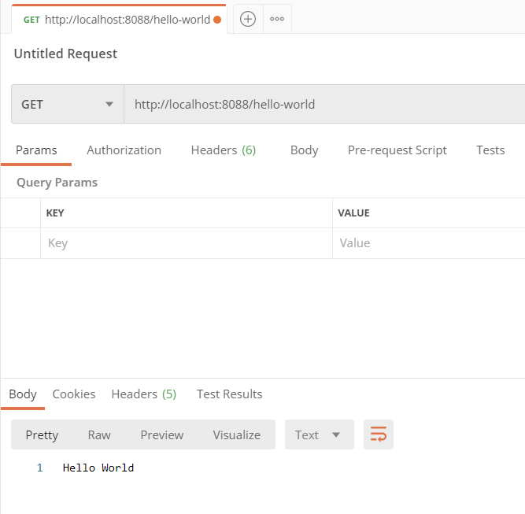  

2. HelloWorldBean을 등록한 뒤, '/hello-world-bean'으로 요청이 들어오는 경우 message를 JSON 형태로 반환  
- lombok 플러그인을 사용하였다. (getter, setter, constructor가 모두 자동으로 등록됨.. 😮)  
- RestController Annotation을 활용하면 반환시키고자 하는 데이터 값을 Response Body에 저장하지 않더라도 자동으로 JSON 포맷으로 변경되어 반환됨.  
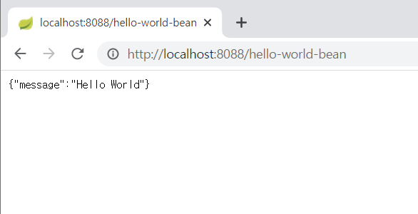  
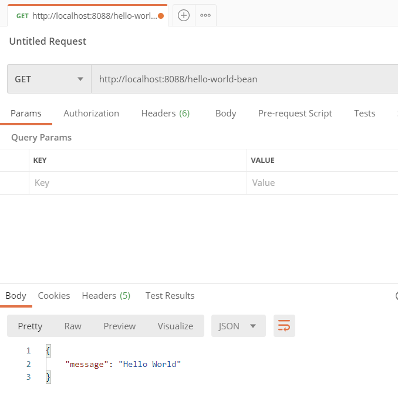  

3. DispatcherServlet과 프로젝트 동작의 이해  
- DispatcherServlet이란?  
    클라이언트의 모든 요청을 한 곳으로 받아서 처리
    요청에 맞는 핸들러로 요청을 전달
    핸들러의 실행 결과를 http Response 형태로 만들어서 반환  
    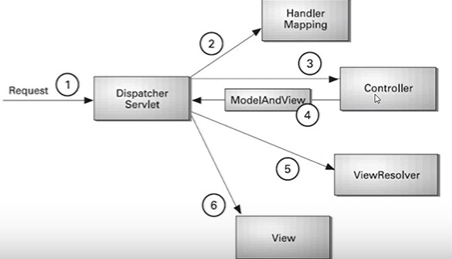  
- RestController  
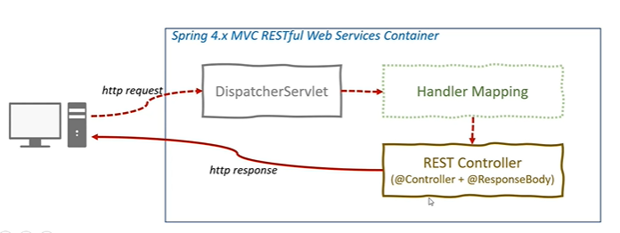  

4. url에 가변 변수 사용  
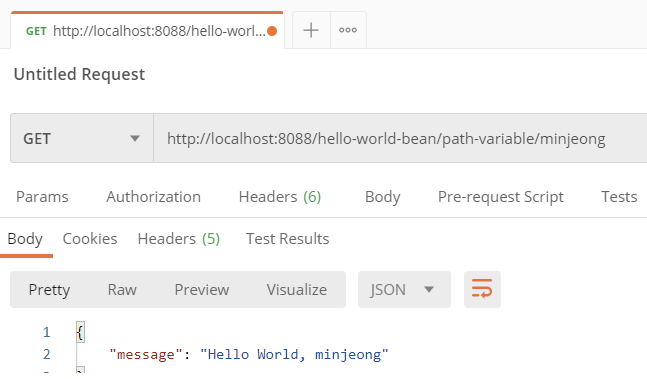  

5. User 도메인 클래스 생성  
- user package 생성  
- 하위에 User 클래스와 UserDaoService라는 DB 이용 오브젝트 서비스 클래스 생성 
 
6. 사용자 목록 조회를 위한 api 구현 - get http
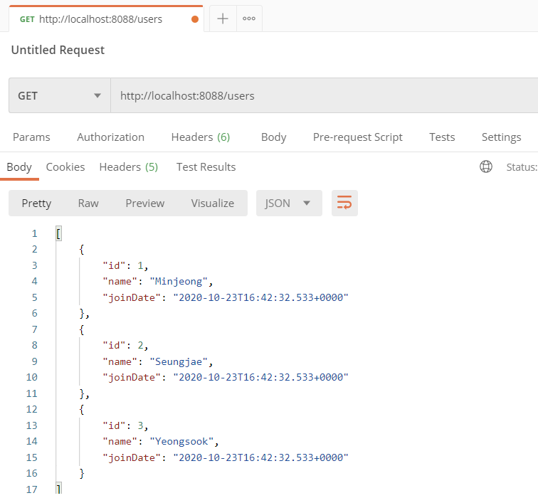  
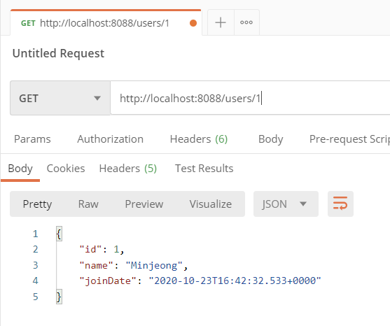   

7. 사용자 등록을 위한 api 구현 - post method  
같은 url이어도 method에 따라서 하는 역할이 달라진다.  
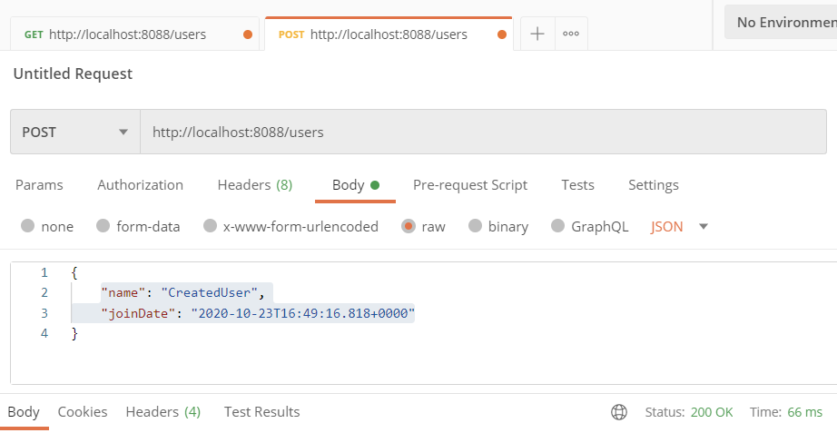  
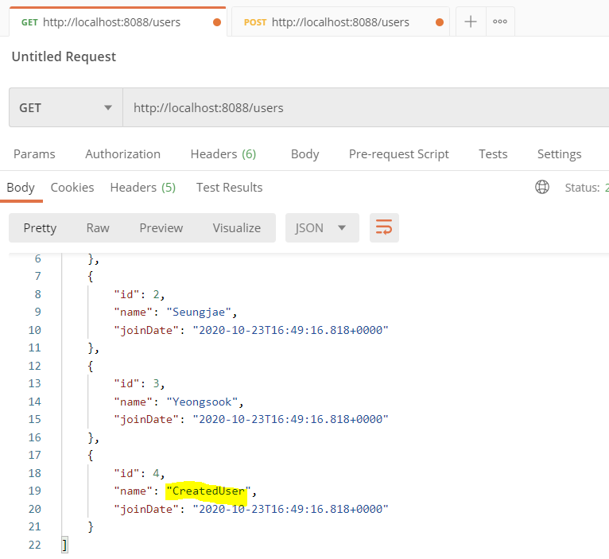  

8. HTTP STATUS CODE 제어  
서버에서 반환시켜주고자 하는 값을 ResponseEntitiy에 담아서 전달.  
이 예제에서는 userid가 서버에서 생성되므로 그를 포함한 uri를 리턴한다.
rest api를 개발할 때, 예외 핸들링을 조합해서 적절한 http status code를 전달하는 것이 좋다. 작업 용도에 맞춰서 http 리소스의 상태를 담아서 전달하자!
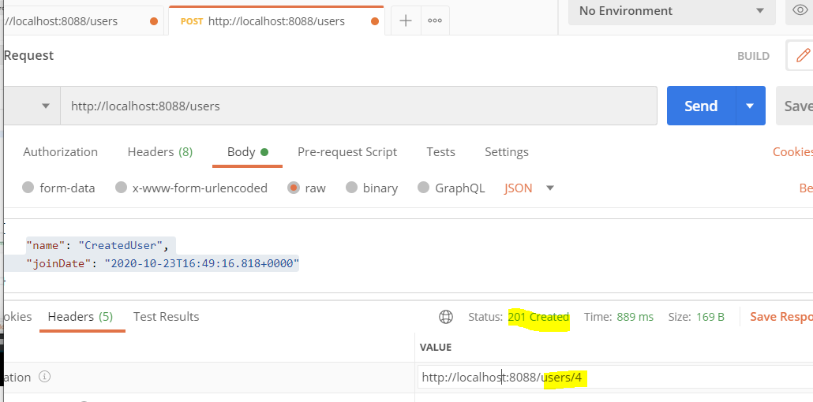  

9. HTTP Status Code 제어를 위한 Exception Handling
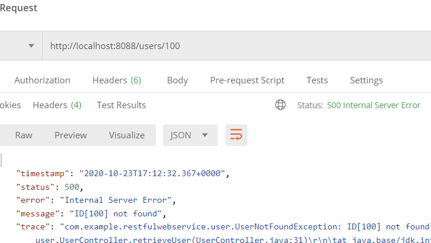  
존재하지 않는 유저를 조회했을 때, 존재하지 않지만 오류는 아니기에 (기존: null을 리턴하도록 함) 2xx의 코드를 나타냈었다.  
따라서, 존재하지 않는 유저를 조회하면 not found 에러가 발생할 수 있도록 변경한다. 하지만 이때는 5xx 에러가 발생하기 때문에 404 not found로 변경하기 위해 @ResponseStatus를 활용하여 not found가 뜨도록 변경하였다.
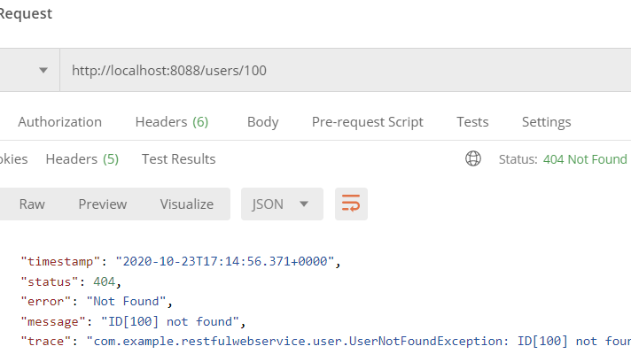  

10. AOP를 활용한 예외 처리  
9.에서는 에러가 발생했을 때 trace를 통해 내부 코드와 관련된 정보가 담길 수도 있었다.
이번에는 aop를 활용하여 `CustomizedResponseEntityExceptionHandler` 클래스를 생성하여 에러가 발생했을 때 우리가 전달하고 싶은 정보만 담아서 전달할 수 있도록 구성하였다.  
  

11. 사용자 삭제를 위한 api 구현 - DELETE METHOD  
입력된 id에 해당하는 사용자를 delete method를 활용하여 삭제하는 것을 구현해보았다.  
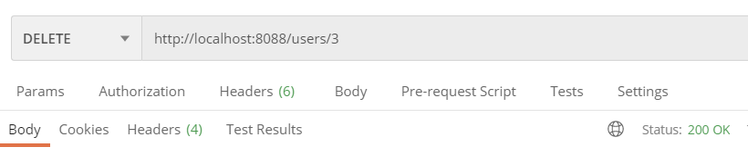  
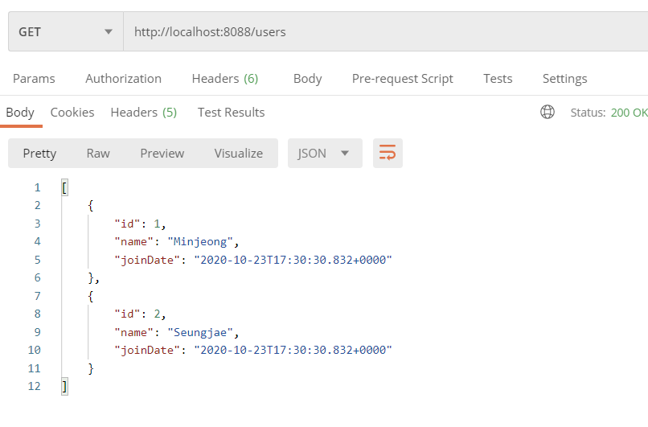

 

