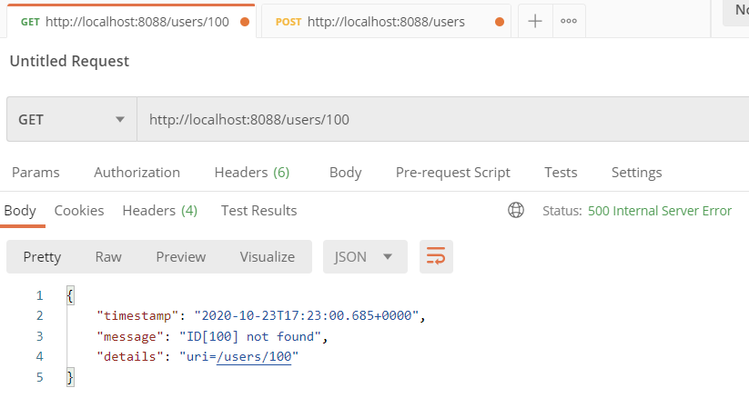

## REST API using Spring Boot

### 시나리오
사용자와 관련된 REST API 제작, (사용자가 작성하는 간단한 글)  
- 한명의 사용자는 여러개의 포스팅 가능  
	-> User와 Posts는 1대다의 관계를 가진다.  

제공하는 기능: `조회, 생성, 삭제 기능`  

Description|REST API|HTTP Method
------------|----------|----------
전체 사용자 조회|/users|GET
사용자 생성|/users|POST
특정 사용자 조회|/users/{id}|GET
특정 사용자 삭제|/users/{id}|DELETE
사용자의 모든 포스트 조회|/users/{id}/posts|GET
사용자의 포스트 생성|/users/{id}/posts|POST
사용자의 상세 정보 조회|/users/{id}/posts/{post_id}|GET


## 과정
1. HelloWorldController를 등록하여 web과 POSTMAN을 통해 확인해봄. 
   
  
  
  
   
2. HelloWorldBean을 등록한 뒤, '/hello-world-bean'으로 요청이 들어오는 경우 message를 JSON 형태로 반환  
- `lombok` 플러그인을 사용하였다. (`getter`, `setter`, `constructor`가 모두 자동으로 등록됨.. 😮)  
- `RestController Annotation`을 활용하면 반환시키고자 하는 데이터 값을 Response Body에 저장하지 않더라도 자동으로 JSON 포맷으로 변경되어 반환됨.  
  
  
  

3. DispatcherServlet과 프로젝트 동작의 이해  
- DispatcherServlet이란?  
    클라이언트의 모든 요청을 한 곳으로 받아서 처리
    요청에 맞는 핸들러로 요청을 전달
    핸들러의 실행 결과를 http Response 형태로 만들어서 반환 
       
      
- RestController  
  
  

4. url에 가변 변수 사용 
   
  

5. User 도메인 클래스 생성  
- user package 생성  
- 하위에 User 클래스와 UserDaoService라는 DB 이용 오브젝트 서비스 클래스 생성 
 
6. 사용자 목록 조회를 위한 api 구현 - get http
  
  
   

7. 사용자 등록을 위한 api 구현 - post method  
같은 url이어도 method에 따라서 하는 역할이 달라진다.  
  
  
  

8. HTTP STATUS CODE 제어  
서버에서 반환시켜주고자 하는 값을 `ResponseEntitiy`에 담아서 전달.  
이 예제에서는 userid가 서버에서 생성되므로 그를 포함한 `uri`를 리턴한다.
rest api를 개발할 때, 예외 핸들링을 조합해서 적절한 `http status code`를 전달하는 것이 좋다. 작업 용도에 맞춰서 http 리소스의 상태를 담아서 전달하자!
  
  

9. HTTP Status Code 제어를 위한 Exception Handling
  
  
존재하지 않는 유저를 조회했을 때, 존재하지 않지만 오류는 아니기에 (기존: null을 리턴하도록 함) 2xx의 코드를 나타냈었다.  
따라서, 존재하지 않는 유저를 조회하면 not found 에러가 발생할 수 있도록 변경한다. 하지만 이때는 5xx 에러가 발생하기 때문에 404 not found로 변경하기 위해 @ResponseStatus를 활용하여 not found가 뜨도록 변경하였다.
  
  

10. AOP를 활용한 예외 처리  
9.에서는 에러가 발생했을 때 trace를 통해 내부 코드와 관련된 정보가 담길 수도 있었다.
이번에는 aop를 활용하여 `CustomizedResponseEntityExceptionHandler` 클래스를 생성하여 에러가 발생했을 때 우리가 전달하고 싶은 정보만 담아서 전달할 수 있도록 구성하였다.  
  
  

11. 사용자 삭제를 위한 api 구현 - DELETE METHOD  
입력된 id에 해당하는 사용자를 delete method를 활용하여 삭제하는 것을 구현해보았다.  
  
  
  

12. 사용자 수정을 위한 api 구현 - PUT METHOD  
입력된 User 객체의 id와 일치하는 사용자가 존재한다면, 기존의 user 정보를 새롭게 입력된 user 정보로 업데이트한다.  
  
  
  

13. 유효성 체크를 위한 Validation API 사용  
User 클래스에 Validation을 추가한다. 이름은 최소 2글자 이상, Date는 과거의 일자만 입력할 수 있도록 하는 조건을 추가했다.  
이후 Postman을 통해 확인해본 결과는 다음과 같다. 조건을 만족시키지 않는 경우에는 404 Bad Request Status code를 나타내며, Status code 이외에
body에 에러 메시지를 담기 위해 `CustomizedResponseEntityExceptionHandler`에 Not Valid에 대한 에러 핸들러도 추가하였다. 
   
  
  

14. 다국어 처리를 위한 Internationalization 구현  
먼저, `@SpringBootApplication` 어노테이션이 있는 java 파일에`LocaleResolver`라는 `@Bean`을 등록한다.
이후, `messages.properties`를 en, fr 그리고 기본(ko)으로 생성한 뒤, `Controller`에서 `Header`에 들어오는 정보에 따라 알맞은 언어로 처리해주도록 설정하였다.  
* POSTMAN에서 한글이 깨지는 현상이 발생했다. 이는 Intellj에서 UTF-8 인코딩 설정을 한 뒤, 재실행하면 해결되었다.  
  

  
 

15. Response 데이터 형식 변환 -XML 포맷  
헤더의 VALUE로 `application/xml` 형태로 요청했을 때 적절한 형식으로 변환하여 처리하기 위해 라이브러리를 추가한다.  
```
<dependency>
    <groupId>com.fasterxml.jackson.dataformat</groupId>
    <artifactId>jackson-dataformat-xml</artifactId>
    <version>2.10.2</version>
</dependency>
```  
  
  

16. Response 데이터 제어를 위한 Filtering  
`User`에 `password`와 `ssn`을 등록한다. 하지만 이 정보들을 외부에 노출되면 안되는 정보들이다. 해결할 수 있는 방법으로는 `*`로 대체해서 보여주는 방법 (ex. password:1234 -> password:****), 또는 아예 null 값으로 리턴하는 방법  
15.에서 등록한 jackson 라이브러리를 활용하면, 외부에 노출시키고 싶지 않은 데이터의 처리가 가능하다. 해당 데이터에 `@JsonIgnore` 어노테이션을 통해 노출되지 않도록 할 수 있다. 이는 해당하는 필드까지 보여지지 않도록 한다.
하지만 이 방법을 사용하면 클라이언트에게만 보이지 않도록 처리할 수 있고, Debug 로그에는 그대로 모든 정보가 찍히게 된다.  


17. Filtering - 개별 사용자 조회 및 전체 사용자 조회/ admin 
필드를 가진 클래스를 제어하고 싶을 때에는 `Filter`라는 클래스를 활용하여 제어할 수 있다.  
  
   

18. REST API Version 관리  
rest api가 변경될 때에도 버전 관리를 사용하고 또한 사용자에게 적절한 버전을 안내할 때에도 버전을 사용한다.  
- URI  
    URI를 활용하여 V1, V2에 따라 REST API 를 관리해보았다. V2로 요청하는 경우에는 User 도메인 클래스에 `grade`라는 필드를 추가하여 보여질 수 있도록 하였다.  
    `URI: @GetMapping("v2/users/{id}"), 브라우저 O` 
- Request Param and Header, MIME-type  
    `Param : @GetMapping(value = "/users/{id}/", params = "version=2"), 브라우저 O`  
    `Header : @GetMapping(value = "/users/{id}/", headers = "X-API-VERSION2"), 브라우저 X`  
    `MIME-TYPE: @GetMapping(value = "/users/{id}/", produces = "application/vnd.company.appv2+json"), 브라우저 X`  
    
* URI 값에 과도한 정보를 넣는 것은 지양  
* 잘못된 헤더 값을 사용하는 것 주의  
* 인터넷 캐시로 반영이 안될 수도 있음. (캐시가 남아있어 이전의 데이터가 그대로 사용될 수 있음)  
* api는 적절한 용도에 따라서 웹브라우저에서 작동할 수 있어야 한다.  
* 모든 REST API에 대해서는 API Documentation이 필요하다.  
  
    


19. Level3 단계의 REST API 구현을 위한 HATEOAS 적용  
HATEOAS(hypermedia as the engine of application state): 현재 리소스와 연관된 자원 상태 정보를 제공  
  
  


20. REST API Documentation을 위한 Swagger  
- `localhost:8088/v2/api-docs`  
  
  
- `localhost:8088/swagger-ui.html`  
  
  

21. Customize Swagger Documentation  
Contact, APIInfo, Produces and Consumes를 api docs에 추가  
  
  
  
User 클래스에 description 추가  
  

22. Set Actuator for REST API Monitoring  
23. HAL 브라우저를 이용한 hateoas 기능 구현  
hal은 api의 리소스들 간에 쉽게 hyperlink를 제공해주는 간단한 포맷이다. 따라서 해당 api를 사용하는 다른 개발자들에게 좀 더 좋은 환경을 제공할 수 있다.  
즉, 우리가 제공하는 정보에 특정 정보에 대한 link를 추가하는 것!!  
24. Spring Security  
rest api app에 인증을 처리하기 위한 방법 -> 토큰, id와 비밀번호를 이용하는 방법 등등  
Spring boot security에서 제공하는 인증처리 방법을 활용하여 빌드한 뒤, 생성된 password를 이용하여 api 정보를 요청하고 제공받을 수 있다.  
  
  
25. Configuration 클래스를 이용한 사용자 인증 처리  
먼저, `yml` 파일에 security를 등록하여 고정된 `username`과 `password`를 이용하여 권한을 인정받는 방식을 테스트 해 보았다.  
  
  
하지만 고정된 값을 이용하는 경우 값을 변경하고 싶을 때엔 매번 서버를 재가동해야한다. 따라서 고정되어있는 정보가 아닌 `Config`를 통해 사용자 정보를 가져오도록 설정하였다.  
  
  

26. JPA  
* JPA란?
    현재 자바 진영의 ORM 기술 표준으로, 인터페이스의 모음이다.
    즉, 실제로 동작하는 것이 아니다. (구현체)
    JPA 2.1 표준 명세를 구현한 세가지 구현체: `Hibernate`,`EclipseLink`,`DataNucleus`  
* ORM이란?
    객체 관계 매핑 -> 객체는 객체대로 설계하고, 관계형 데이터베이스는 관계형 데이터베이스대로 설계한다.  
    ORM 프레임워크가 중간에서 `매핑`하는 역할

27. JPA 사용을 위한 Dependency 추가와 설정  
28. Spring Data JPA를 이용한 Entity 설정과 초기 데이터 생성  
초기 데이터를 생성하고, h2 데이터베이스에 insert하였다.  
    


29. JPA Service 구현을 위한 Controller, Repository 생성  
  


